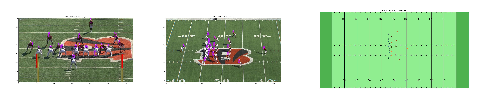

# [Kaggle - NFL Health and Safety 2021](https://www.kaggle.com/c/nfl-health-and-safety-helmet-assignment/overview)

Team: **Krapukhin Bros.** (Dmitry Krapukhin , Alexander Krapukhin )  
Solution Notebook: **[Submission_pr0.627_pub0.730_0p723.ipynb](https://github.com/krapukhin/Kaggle-NFL_Health_and_Safety_2021/blob/main/Submission_pr0.627_pub0.730_0p723.ipynb)**

### Goal: 
Segment and label helmets in video footage 
In this competition, you’ll identify and assign football players’ helmets from video footage. In particular, you'll create algorithms capable of assigning detected helmet impacts to correct players via tracking information.

The data contains Endzone-view, Sideline-view and Track (the picture below shows an aggregated view).

### Solution idea: 

- Finds the optimal matrix of rotation and transformation, based on 2D and 3D coordinates (Modern Posit)  
- [Tracking (PyTorch Yolov5 + Deep Sort)](https://github.com/mikel-brostrom/Yolov5_DeepSort_Pytorch)

### Results: 
This solution achieves a Private score: 0.627 (🥈~40 place out of 825).
 

### Useful links:

1. https://github.com/Liumouliu/Deep_blind_PnP

2. DeepSort ([GitHub](https://github.com/mikel-brostrom/Yolov5_DeepSort_Pytorch/blob/master/deep_sort_pytorch/deep_sort/deep_sort.py))

3. Самая сложная задача в Computer Vision ([habr.com](https://habr.com/ru/company/recognitor/blog/505694/)) 

4. Как работает Object Tracking на YOLO и DeepSort ([habr.com](https://habr.com/ru/post/514450/)) 

5. DeepSORT: Deep Learning to Track Custom Objects in a Video ([nanonets.com](https://nanonets.com/blog/object-tracking-deepsort/)) ([webarchive](https://web.archive.org/web/20191028211732/))  

6. 3D Rotations and Euler angles in Python ([meccanismocomplesso.org](https://www.meccanismocomplesso.org/en/3d-rotations-and-euler-angles-in-python/))  

7. Head Pose Estimation using OpenCV and Dlib [(learnopencv.com)](https://learnopencv.com/head-pose-estimation-using-opencv-and-dlib/)  

8.  How a Kalman filter works in pictures [(bzarg.com)](https://www.bzarg.com/p/how-a-kalman-filter-works-in-pictures/)   

9.  Solving the Blind Perspective-n-Point Problem End-To-End With Robust Differentiable Geometric Optimization ([arxiv.org](https://arxiv.org/pdf/2007.14628.pdf) + [separate appendix](https://static-content.springer.com/esm/chp%3A10.1007%2F978-3-030-58536-5_15/MediaObjects/504434_1_En_15_MOESM1_ESM.pdf))  

10. https://www.pythonpool.com/opencv-solvepnp/
11. [Kaggle notebook #1 Simple Helmet Mapping](https://www.kaggle.com/its7171/nfl-baseline-simple-helmet-mapping)
12. [Kaggle notebook #2 Helper Code + Helmet Mapping + Deepsort
](https://www.kaggle.com/robikscube/helper-code-helmet-mapping-deepsort)
13. How to `import Pool from multiprocessing` - Multiprocessing works fine on Linux. But there are some troubles on Windows and Mac OS. The best solution is to replace to `multiprocessing` to `multiprocess` ([thanks stackoverflow](https://stackoverflow.com/questions/52127722/multiprocessing-pool-map-does-not-do-anything)).

### **Krapukhin Bros.** other solution:
The other solution of **Krapukhin Bros.** ™  will be available [here](https://github.com/akrapukhin?tab=overview&from=2021-11-01&to=2021-11-30). It has a Private score  0.717 (🥈 32 place out of 825 ). 
